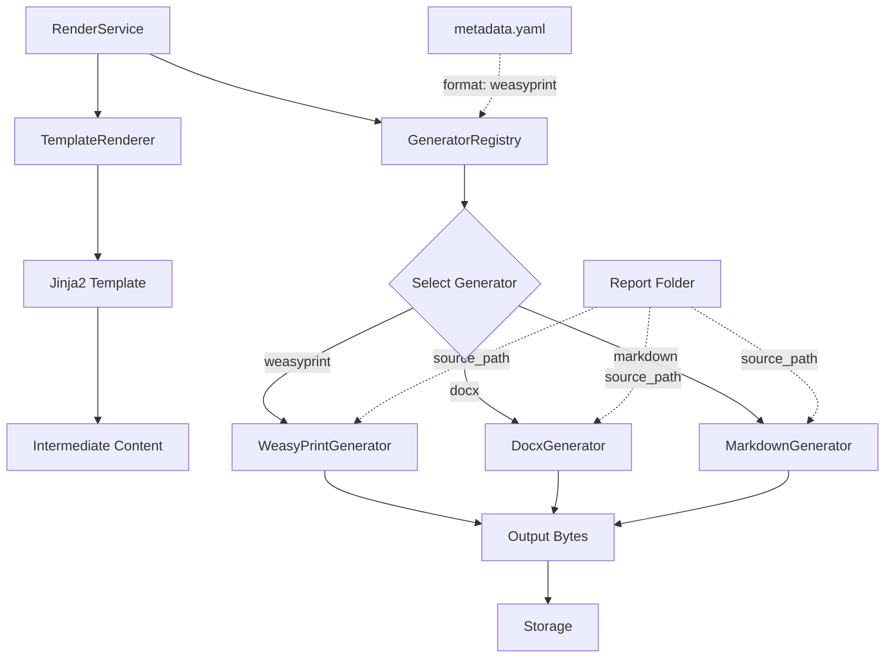

# Multi-Format Rendering Architecture Plan

## Overview

This plan outlines the refactoring needed to support multiple output formats (PDF, DOCX, etc.) with different rendering engines. The key principle is that each rendering engine may require different source formats, even if they're all HTML-based.

## Key Clarifications

1. **DOCX Generation**: Out of scope for initial implementation. Prepare architecture for future pandoc-based implementation. Multiple generators (pandoc + others) may be added later.

2. **Template Discovery**: Auto-discover template files matching pattern `index.*.j2` (e.g., `index.html.j2`, `index.md.j2`). Each report should have exactly one template file.

3. **Storage Strategy**: Storage backend continues to use `cache_key` only. Since each report supports only one rendering engine, the file extension is determined by the generator and stored in the database, but storage uses cache_key for file naming.

## Current Architecture


**Current Flow:**
1. Execute SQL queries
2. Render Jinja2 template → HTML
3. Convert HTML to PDF using WeasyPrint
4. Store PDF file

**Limitations:**
- Hardcoded to PDF output only
- No support for other formats (DOCX, etc.)
- Generator doesn't have access to source folder for additional files
- Format is not configurable per-report

## Proposed Architecture



**New Flow:**
1. Execute SQL queries
2. Render Jinja2 template → Intermediate content (HTML, Markdown, etc.)
3. Read format from metadata.yaml
4. Select appropriate generator from registry
5. Pass intermediate content + source folder path to generator
6. Generator produces output bytes
7. Store output file with correct extension

## Key Design Decisions

### 1. Format-Agnostic Interface

The interface should not assume HTML → PDF. Instead:
- **Input**: Generic "source content" (string) + source folder path
- **Output**: Generic "output bytes" + file extension

```python
class OutputGenerator(ABC):
    @abstractmethod
    async def generate(
        self, 
        source_content: str, 
        source_path: Path,
        base_url: str | None = None
    ) -> tuple[bytes, str]:
        """
        Generate output from source content.
        
        Args:
            source_content: Rendered template content (HTML, Markdown, etc.)
            source_path: Path to report folder (for accessing additional files)
            base_url: Optional base URL for resolving relative paths
            
        Returns:
            Tuple of (output_bytes, file_extension)
        """
        pass
```

### 2. Generator Registry Pattern

A registry maps format names to generator instances:

```python
class GeneratorRegistry:
    def __init__(self):
        self._generators: Dict[str, OutputGenerator] = {}
    
    def register(self, format_name: str, generator: OutputGenerator):
        """Register a generator for a specific format."""
        self._generators[format_name] = generator
    
    def get_generator(self, format_name: str) -> OutputGenerator:
        """Get generator for specified format."""
        if format_name not in self._generators:
            raise ValueError(f"Unknown format: {format_name}")
        return self._generators[format_name]
    
    def list_formats(self) -> List[str]:
        """List all supported formats."""
        return list(self._generators.keys())
```

### 3. Per-Report Format Configuration

Add `format` field to metadata.yaml:

```yaml
name: "Simple Test Report"
description: "A simple report"
version: "1.0"
format: "weasyprint"  # NEW FIELD
timeout: 60
parameters:
  # ... existing parameters
```

### 4. Template Auto-Discovery

Each report has exactly one template file matching pattern `index.*.j2`:
- `index.html.j2` - For HTML-based generators (WeasyPrint, etc.)
- `index.md.j2` - For Markdown-based generators
- `index.tex.j2` - For LaTeX-based generators

The `Report` class will auto-discover the template file during loading. This allows different reports to use different source formats based on their rendering engine requirements.

**Implementation in Report class**:
```python
class Report:
    def __init__(self, path: Path, metadata: ReportMetadata):
        self.path = path
        self.metadata = metadata
        
        # Auto-discover template file
        template_files = list(path.glob("index.*.j2"))
        if len(template_files) == 0:
            raise ValueError(f"No template file (index.*.j2) found in {path.name}")
        if len(template_files) > 1:
            raise ValueError(f"Multiple template files found in {path.name}: {template_files}")
        
        self.template_path = template_files[0]
        self.query_files = sorted(path.glob("*.sql"))
```

## Implementation Plan

### Phase 1: Create Interface and Refactor Existing Generator

#### 1.1 Create OutputGenerator Interface

**File**: `render/services/output_generator.py` (new)

```python
from abc import ABC, abstractmethod
from pathlib import Path


class OutputGenerator(ABC):
    """Abstract base class for output generators."""
    
    @abstractmethod
    async def generate(
        self, 
        source_content: str, 
        source_path: Path,
        base_url: str | None = None
    ) -> tuple[bytes, str]:
        """
        Generate output from source content.
        
        Args:
            source_content: Rendered template content
            source_path: Path to report folder for accessing additional files
            base_url: Optional base URL for resolving relative paths
            
        Returns:
            output_bytes
        """
        pass
    
    @property
    @abstractmethod
    def format_name(self) -> str:
        """
        Return the format name this generator implements.
        This methods should return specific name (weasyprint), not output extension.
        """
        pass

    @property
    @abstractmethod
    def file_extension(self) -> str:
        """Return the extension of the file this generator produces."""
        pass
```

#### 1.2 Rename and Update PDFGenerator

**Action**: Rename `render/services/pdf_generator.py` → `render/services/weasyprint_generator.py`

**Changes**:
- Rename class `PDFGenerator` → `WeasyPrintGenerator`
- Implement `OutputGenerator` interface
- Update `generate()` signature to accept `source_path`

```python
from pathlib import Path
from .output_generator import OutputGenerator


class WeasyPrintGenerator(OutputGenerator):
    """Generate PDF using WeasyPrint from HTML."""
    
    @property
    def format_name(self) -> str:
        return "weasyprint"
    
    @property
    def file_extension(self) -> str:
        return "pdf"

    async def generate(
        self, 
        source_content: str, 
        source_path: Path,
        base_url: str | None = None
    ) -> bytes:
        """
        Convert HTML to PDF using WeasyPrint.
        
        Args:
            source_content: HTML string to convert
            source_path: Path to report folder (for accessing images, etc.)
            base_url: Base URL for resolving relative paths
            
        Returns:
            Tuple of (pdf_bytes, "pdf")
        """
        try:
            logger.info(f"Generating PDF from HTML (source: {source_path})")
            
            # If base_url not provided, use source_path as base
            if base_url is None:
                base_url = source_path.as_uri()
            
            pdf_file = BytesIO()
            HTML(string=source_content, base_url=base_url).write_pdf(pdf_file)
            pdf_bytes = pdf_file.getvalue()
            
            logger.info(f"PDF generated successfully, size: {len(pdf_bytes)} bytes")
            return pdf_bytes
            
        except Exception as e:
            logger.error(f"PDF generation failed: {e}")
            raise RuntimeError(f"PDF generation failed: {e}")
```

### Phase 2: Update Metadata Model

#### 2.1 Add Format Field to ReportMetadata

**File**: `render/models/metadata.py`

```python
class ReportMetadata(BaseModel):
    """Comprehensive metadata for a report."""
    
    id: str
    name: str
    description: Optional[str] = None
    version: str = "1.0"
    format: str = Field(
        default="weasyprint",
        description="Output format generator to use (weasyprint, pandoc-docx, etc.)"
    )  # NEW FIELD
    timeout: Optional[int] = Field(
        default=None, description="Maximum rendering time in seconds"
    )
    cache_ttl_minutes: Optional[int] = Field(
        default=None, description="Cache time-to-live in minutes"
    )
    parameters: List[ReportParameter] = Field(
        default_factory=list, description="List of parameters"
    )
```

#### 2.2 Update Repository to Parse Format

**File**: `render/services/repository.py`

In `_load_report()` method, add:

```python
metadata = ReportMetadata(
    id=report_dir.name,
    name=metadata_dict.get("name", report_dir.name),
    description=metadata_dict.get("description"),
    version=metadata_dict.get("version", "1.0"),
    format=metadata_dict.get("format"),  # NEW LINE
    timeout=metadata_dict.get("timeout"),
    cache_ttl_minutes=metadata_dict.get("cache_ttl_minutes"),
    parameters=parameters,
)
```

### Phase 3: Create Generator Registry

#### 3.1 Implement GeneratorRegistry

**File**: `render/services/generator_registry.py` (new)

```python
import logging
from typing import Dict

from .output_generator import OutputGenerator

logger = logging.getLogger(__name__)


class GeneratorRegistry:
    """Registry for output format generators."""
    
    def __init__(self):
        self._generators: Dict[str, OutputGenerator] = {}
    
    def register(self, generator: OutputGenerator) -> None:
        """
        Register a generator.
        
        Args:
            generator: OutputGenerator instance to register
        """
        format_name = generator.format_name
        if format_name in self._generators:
            logger.warning(f"Overwriting existing generator for format: {format_name}")
        
        self._generators[format_name] = generator
        logger.info(f"Registered generator for format: {format_name}")
    
    def get_generator(self, format_name: str) -> OutputGenerator:
        """
        Get generator for specified format.
        
        Args:
            format_name: Format identifier (e.g., "weasyprint", "docx")
            
        Returns:
            OutputGenerator instance
            
        Raises:
            ValueError: If format is not registered
        """
        if format_name not in self._generators:
            available = ", ".join(self._generators.keys())
            raise ValueError(
                f"Unknown format: {format_name}. Available formats: {available}"
            )
        
        return self._generators[format_name]
    
    def list_formats(self) -> list[str]:
        """List all registered format names."""
        return list(self._generators.keys())
    
    def is_registered(self, format_name: str) -> bool:
        """Check if a format is registered."""
        return format_name in self._generators


# Global registry instance
generator_registry = GeneratorRegistry()

# Register default generators
from .weasyprint_generator import weasyprint_generator
generator_registry.register(weasyprint_generator)
```

#### 3.2 Update WeasyPrintGenerator Module

**File**: `render/services/weasyprint_generator.py`

Add at the end:

```python
# Global WeasyPrint generator instance
weasyprint_generator = WeasyPrintGenerator()
```

### Phase 4: Update RenderService

#### 4.1 Modify RenderService to Use Registry

**File**: `render/services/render_service.py`

Key changes:

1. Import generator registry instead of pdf_generator
2. Get format from metadata
3. Use registry to get appropriate generator
4. Update variable names (html → source_content, pdf → output)
5. Handle dynamic file extensions

```python
from .generator_registry import generator_registry

class RenderServiceImpl(RenderServiceInterface):
    
    async def executeRender(
        self, report_id: str, params: Dict[str, Any], force_refresh: bool = False
    ) -> RenderResult:
        """Execute complete render workflow."""
        
        # ... existing cache check code ...
        
        # Get report and metadata
        report = repository.get_report(report_id)
        metadata = report.metadata
        output_format = metadata.format
        
        logger.info(f"Loaded report: {report_id}, format: {output_format}")
        
        # Get appropriate generator
        try:
            generator = generator_registry.get_generator(output_format)
        except ValueError as e:
            logger.error(f"Invalid format in metadata: {e}")
            raise RuntimeError(f"Invalid format configuration: {e}")
        
        # Execute queries
        query_results = await query_executor.execute_queries(report, params)
        logger.info(f"Executed {len(query_results)} queries")
        
        # Render template
        source_content = template_renderer.render(report, params, query_results)
        logger.info("Template rendered successfully")
        
        # Generate output using selected generator
        output_bytes = await generator.generate(
            source_content=source_content,
            source_path=report.path,
            base_url=None
        )
        file_extension = generator.file_extension
        
        logger.info(
            f"Output generated, format: {output_format}, "
            f"size: {len(output_bytes)} bytes, extension: {file_extension}"
        )
        
        # Store output
        output_path = await self.storage.save(cache_key, output_bytes)
        logger.info(f"Output stored at: {output_path}")
        
        # Update database record
        render.status = RenderStatus.COMPLETED.value
        render.completed_at = datetime.utcnow()
        render.output_path = output_path
        render.output_format = output_format
        render.file_extension = file_extension
        render.file_size_bytes = len(output_bytes)
        await db.commit()
        
        # Return result with proper extension
        # Note: Storage uses cache_key, but we return filename with extension for download
        filename = f"{cache_key}.{file_extension}"
        return RenderResult(
            status=RenderStatus.COMPLETED,
            file_path=filename,
            filename=f"{report_id}.{file_extension}"
        )
```

### Phase 5: Update Database Model

#### 5.1 Add Migration for Format Fields

**File**: `alembic/versions/XXXX_add_output_format.py` (new migration)

```python
"""Add output format tracking

Revision ID: XXXX
Revises: 2c3b0c232366
Create Date: 2026-03-18
"""

from alembic import op
import sqlalchemy as sa


def upgrade():
    # Add new columns
    op.add_column('renders', 
        sa.Column('output_format', sa.String(50), nullable=True, 
                  comment='Output format (weasyprint, docx, etc.)'))
    op.add_column('renders', 
        sa.Column('file_extension', sa.String(10), nullable=True,
                  comment='File extension (pdf, docx, etc.)'))
    
    # Set default values for existing records
    op.execute("UPDATE renders SET output_format = 'weasyprint', file_extension = 'pdf'")
    
    # Make columns non-nullable after setting defaults
    op.alter_column('renders', 'output_format', nullable=False)
    op.alter_column('renders', 'file_extension', nullable=False)
    
    # Rename pdf_path to output_path for clarity
    op.alter_column('renders', 'pdf_path', new_column_name='output_path')


def downgrade():
    op.alter_column('renders', 'output_path', new_column_name='pdf_path')
    op.drop_column('renders', 'file_extension')
    op.drop_column('renders', 'output_format')
```

#### 5.2 Update Database Model

**File**: `render/database/models.py`

```python
class Render(Base):
    """Track render jobs and their status."""
    
    __tablename__ = "renders"
    
    parameter_hash = Column(String(64), primary_key=True)
    report_id = Column(String(255), nullable=False, index=True)
    parameters_json = Column(Text, nullable=False)
    status = Column(String(50), nullable=False, index=True)
    
    # Output file information
    output_format = Column(
        String(50), nullable=False, 
        comment="Output format (weasyprint, docx, etc.)"
    )  # NEW
    file_extension = Column(
        String(10), nullable=False,
        comment="File extension (pdf, docx, etc.)"
    )  # NEW
    output_path = Column(
        String(512), nullable=True, 
        comment="Storage path to output file"
    )  # RENAMED from pdf_path
    file_size_bytes = Column(Integer, nullable=True)
    
    error_message = Column(Text, nullable=True)
    created_at = Column(DateTime, nullable=False, default=datetime.utcnow)
    started_at = Column(DateTime, nullable=True)
    completed_at = Column(DateTime, nullable=True, index=True)
    
    # ... rest of model ...
```

### Phase 6: Update Metadata Files

#### 6.1 Add Format to All Reports

Update each `metadata.yaml` file in `sample_reports/`:

**Files to update**:
- `sample_reports/simple-test/metadata.yaml`
- `sample_reports/inspection-rep/metadata.yaml`
- `sample_reports/database-tables/metadata.yaml`
- `sample_reports/table-details/metadata.yaml`

Add after `version` field:

```yaml
format: "weasyprint"
```

### Phase 7: Prepare for Future Generators

#### 7.1 DOCX Generator (Future Implementation)

DOCX generation is out of scope for the initial implementation. The architecture is prepared for future pandoc-based implementation.

**Future File**: `render/services/pandoc_generator.py`

```python
"""Pandoc-based generator for multiple output formats."""

import logging
import subprocess
from pathlib import Path

from .output_generator import OutputGenerator

logger = logging.getLogger(__name__)


class PandocGenerator(OutputGenerator):
    """Generate output using Pandoc."""
    
    def __init__(self, output_format: str, file_extension: str):
        """
        Initialize Pandoc generator.
        
        Args:
            output_format: Pandoc output format (docx, pdf, etc.)
            file_extension: File extension for output (docx, pdf, etc.)
        """
        self._output_format = output_format
        self._file_extension = file_extension
    
    @property
    def format_name(self) -> str:
        return f"pandoc-{self._output_format}"
    
    async def generate(
        self,
        source_content: str,
        source_path: Path,
        base_url: str | None = None
    ) -> tuple[bytes, str]:
        """
        Convert source content to output format using Pandoc.
        
        Args:
            source_content: Source content (HTML, Markdown, etc.)
            source_path: Path to report folder
            base_url: Optional base URL
            
        Returns:
            Tuple of (output_bytes, file_extension)
        """
        try:
            logger.info(f"Generating {self._output_format} using Pandoc (source: {source_path})")
            
            # Use pypandoc or subprocess to call pandoc
            # Example with subprocess:
            result = subprocess.run(
                ['pandoc', '-f', 'html', '-t', self._output_format],
                input=source_content.encode('utf-8'),
                capture_output=True,
                check=True
            )
            
            output_bytes = result.stdout
            logger.info(f"Pandoc generation successful, size: {len(output_bytes)} bytes")
            return (output_bytes, self._file_extension)
            
        except Exception as e:
            logger.error(f"Pandoc generation failed: {e}")
            raise RuntimeError(f"Pandoc generation failed: {e}")


# Example instances (to be registered when needed)
# pandoc_docx_generator = PandocGenerator("docx", "docx")
# pandoc_pdf_generator = PandocGenerator("pdf", "pdf")
```

**Note**: This generator will be implemented in a future phase when DOCX support is needed. Multiple generators (pandoc + others) can coexist in the registry.

### Phase 8: Storage Backend (No Changes Required)

#### 8.1 Storage Strategy

The storage backend continues to use `cache_key` only, without file extensions. This is because:
1. Each report supports only one rendering engine
2. The file extension is stored in the database (`file_extension` column)
3. When serving files, the extension is appended from the database record

**Current Implementation** (no changes needed):

```python
# render/storage/base.py
class StorageBackend(ABC):
    @abstractmethod
    async def save(self, cache_key: str, file_bytes: bytes) -> str:
        """
        Save output file and return storage path.
        
        Args:
            cache_key: Unique cache key (parameter hash)
            file_bytes: Output file content as bytes
            
        Returns:
            Storage path where the file was saved
        """
        pass
```

The storage backend is already format-agnostic and works with any binary content. No modifications are required.

**File Serving**: When serving files to users, the system will:
1. Look up the render record by cache_key
2. Retrieve the `file_extension` from the database
3. Serve the file with the appropriate extension and content-type header

### Phase 9: Update Tests

#### 9.1 Update Existing Tests

**File**: `tests/test_render_service.py`

Update tests to:
- Use `weasyprint_generator` instead of `pdf_generator`
- Test generator registry
- Test format selection from metadata
- Test file extension handling

#### 9.2 Add New Tests

**File**: `tests/test_generator_registry.py` (new)

```python
"""Tests for generator registry."""

import pytest
from render.services.generator_registry import GeneratorRegistry
from render.services.output_generator import OutputGenerator


class MockGenerator(OutputGenerator):
    def __init__(self, format_name: str):
        self._format_name = format_name
    
    @property
    def format_name(self) -> str:
        return self._format_name
    
    async def generate(self, source_content, source_path, base_url=None):
        return (b"mock output", self._format_name)


def test_register_generator():
    registry = GeneratorRegistry()
    generator = MockGenerator("test")
    
    registry.register(generator)
    assert "test" in registry.list_formats()


def test_get_generator():
    registry = GeneratorRegistry()
    generator = MockGenerator("test")
    registry.register(generator)
    
    retrieved = registry.get_generator("test")
    assert retrieved is generator


def test_get_unknown_generator():
    registry = GeneratorRegistry()
    
    with pytest.raises(ValueError, match="Unknown format"):
        registry.get_generator("nonexistent")


def test_list_formats():
    registry = GeneratorRegistry()
    registry.register(MockGenerator("format1"))
    registry.register(MockGenerator("format2"))
    
    formats = registry.list_formats()
    assert "format1" in formats
    assert "format2" in formats
```

## File Structure Changes

### New Files
```
render/services/output_generator.py          # Abstract interface
render/services/generator_registry.py        # Registry implementation
render/services/docx_generator.py            # DOCX generator stub
tests/test_generator_registry.py             # Registry tests
alembic/versions/XXXX_add_output_format.py   # Database migration
```

### Renamed Files
```
render/services/pdf_generator.py → render/services/weasyprint_generator.py
```

### Modified Files
```
render/models/metadata.py                    # Add format field
render/services/repository.py                # Parse format from YAML
render/services/render_service.py            # Use generator registry
render/database/models.py                    # Add format columns
render/storage/base.py                       # Update docstrings
sample_reports/*/metadata.yaml               # Add format field
tests/test_render_service.py                 # Update tests
```

## Migration Path

### Step 1: Backward Compatibility
- Default format is "weasyprint"
- Existing reports without format field work as before
- Database migration sets default values for existing records

### Step 2: Gradual Adoption
- Update metadata files one by one
- Test each report after adding format field
- No breaking changes to API

### Step 3: Future Expansion
- Add new generators (Markdown, LaTeX, etc.)
- Register them in generator_registry.py
- Create reports with new formats

## Benefits

1. **Extensibility**: Easy to add new output formats
2. **Flexibility**: Each report can use different format
3. **Separation of Concerns**: Generator logic isolated from render service
4. **Testability**: Generators can be tested independently
5. **Source Access**: Generators can access report folder for additional files
6. **Format-Agnostic**: Interface doesn't assume HTML→PDF

## Future Enhancements

### Markdown Generator
```python
class MarkdownGenerator(OutputGenerator):
    """Generate Markdown files (pass-through or with processing)."""
    
    @property
    def format_name(self) -> str:
        return "markdown"
    
    async def generate(self, source_content, source_path, base_url=None):
        # Could process Markdown, add TOC, etc.
        return (source_content.encode('utf-8'), "md")
```

### Pandoc-based Generator
```python
class PandocGenerator(OutputGenerator):
    """Use Pandoc to convert to various formats."""
    
    def __init__(self, output_format: str):
        self._output_format = output_format
    
    @property
    def format_name(self) -> str:
        return f"pandoc-{self._output_format}"
    
    async def generate(self, source_content, source_path, base_url=None):
        # Use pypandoc to convert
        import pypandoc
        output = pypandoc.convert_text(
            source_content, 
            self._output_format, 
            format='html'
        )
        return (output.encode('utf-8'), self._output_format)
```

### Template-per-Format
Allow different templates for different formats:
- `index.html.j2` - For HTML-based formats
- `index.md.j2` - For Markdown formats
- `index.tex.j2` - For LaTeX formats

Update `Report` class to select template based on format.
